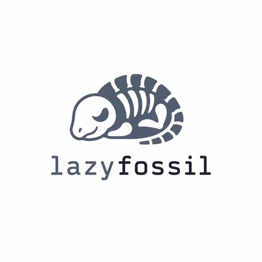
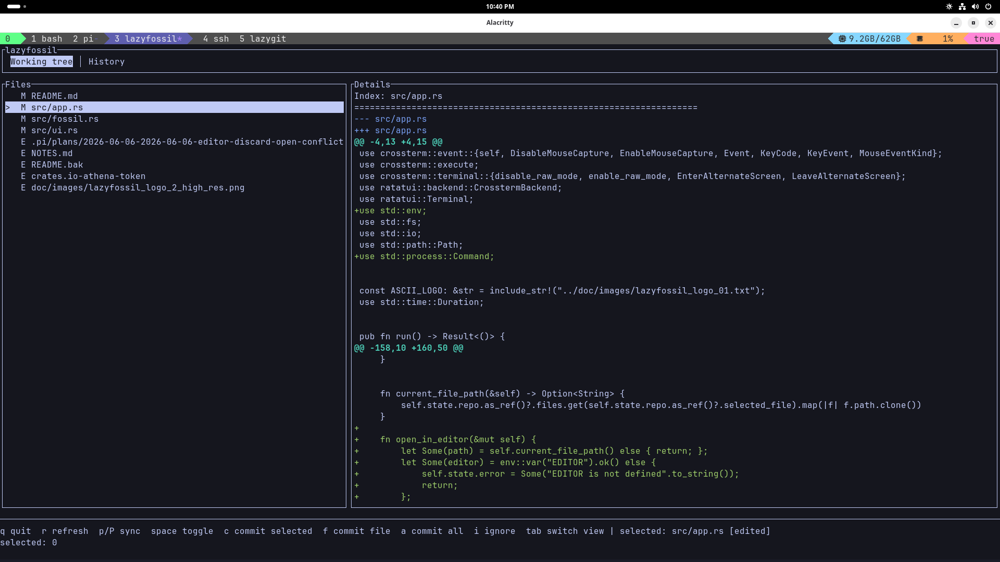
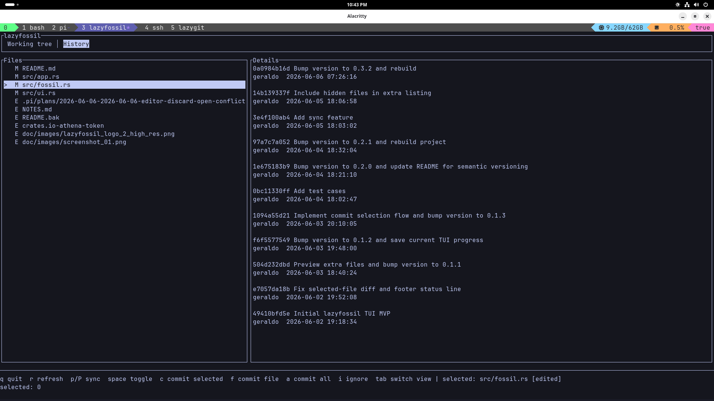
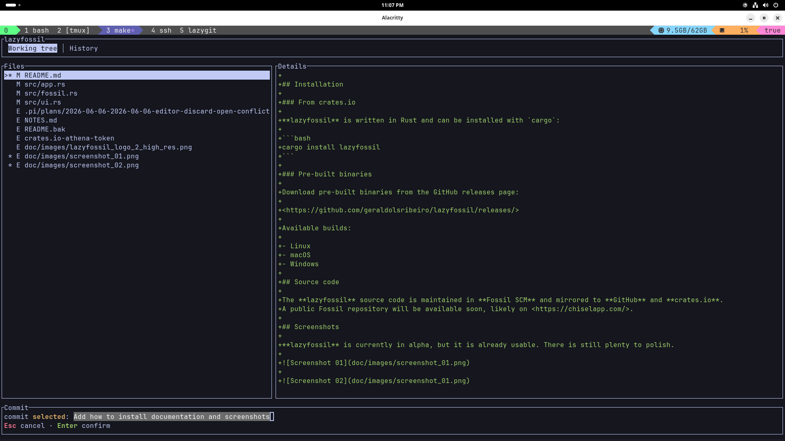

# lazyfossil

[](https://crates.io/crates/lazyfossil)
[](https://github.com/geraldolsribeiro/lazyfossil/actions/workflows/release.yml)
[](https://opensource.org/licenses/MIT)
[](https://github.com/geraldolsribeiro/lazyfossil/stargazers)




A lazygit-inspired terminal UI for Fossil SCM.

## Project goals

- Provide a fast terminal workflow for Fossil checkouts
- Combine working-tree and history browsing in a single UI
- Commit subsets of files without a staging area
- Start with a small, practical MVP and refine it over time

## Installation

### From crates.io

This is the preferable way to install and update **lazyfossil**.

**lazyfossil** is written in Rust and can be installed with `cargo`:

```bash
cargo install lazyfossil
```

Make sure you have **Rust** installed first, if not visit <https://rust-lang.org/tools/install/>.

### Pre-built binaries

Download pre-built binaries from the GitHub releases page:

<https://github.com/geraldolsribeiro/lazyfossil/releases/>

Available builds:

- Linux
- macOS
- Windows

## Source code

The **lazyfossil** source code is maintained in **Fossil SCM** and mirrored to **GitHub** and **crates.io**.
A public Fossil repository will be available soon, likely on <https://chiselapp.com/>.

## Screenshots

**lazyfossil** is currently in alpha, but it is already usable. There is still plenty to polish.







## Features

### Repository browsing
- Fossil checkout detection
- Full project file list plus extra files
- Diff/details pane with binary-safe preview
- Timeline/history view
- File-history timeline for the selected path
- Hidden-file listing (`extras --dotfiles`)
- Keyboard and mouse navigation

### Commit and sync flow
- Temporary file selection for commit with `Space`
- Commit selected files, the current file, or all files
- Automatic add extra-files before commit
- Ignore-file editing via `.fossil-settings/ignore-glob`
- Sync with the remote via `p` (pull) / `P` (push)
- Binary-file handling before commit via `binary-glob`
- Confirmation dialogs for ignore and discard actions

### Preview and UI polish
- Binary preview fallback with a friendly notice
- `o` to open binaries externally
- `H` hex dump toggle for binary files
- Tab-expanded text previews (for example, Makefiles)
- Compact shortcut status line
- Footer and input UX improvements
- Reusable ASCII logo text asset

## Commit flow

Fossil does not use a staging area like git does.
Instead, lazyfossil builds commit commands like:

```bash
fossil commit -m "commit message" file1 file2 file3
```

Extra files are added automatically before commit when needed.

Binary files are handled by setting:

```bash
fossil settings binary-glob "*.png,*.jpg,*.jpeg,*.gif,*.ico"
```

## Keybinds

### Navigation
- `Up` / `Down`: move between files
- `Tab`: switch between Working tree and History
- Mouse click: select a file
- Mouse wheel: scroll the diff/details pane

### File actions
- `Space`: toggle the selected file for commit
- `e`: open the current file in `$EDITOR`
- `o`: open the current file in the default program for its file type
- `d`: discard the current file
- `i`: add the current file to `.fossil-settings/ignore-glob`

### Commit and sync
- `c`: commit selected files
- `f`: commit the current file
- `a`: commit all files
- `p` / `P`: sync with the remote

### General
- `r`: refresh
- `q`: quit

## Roadmap

### Done
- Working-tree MVP
- History timeline basics
- Temporary selection-based commit flow
- Inline commit message prompt
- Ignore-file support
- Sync support
- Binary preview fallback

### Next
- Commit details and file history in the history pane
- Footer and status layout polish
- Better mouse interactions and scrolling

## Versioning

This project follows semantic versioning: `MAJOR.MINOR.PATCH`.
Current version: `0.5.2`.

## Star History

[](https://www.star-history.com/?repos=geraldolsribeiro%2Flazyfossil&type=date&legend=top-left)

## Credits

### [pi.dev](https://pi.dev)
Pi provides the agent harness used to develop and refine this project. Its tooling made it easier to iterate quickly, validate changes, and improve the TUI with confidence.

### [crates.io/crates/lazyfossil](https://crates.io/crates/lazyfossil)
The crates.io listing is the distribution channel for the Rust application, helping make lazyfossil available to the broader Rust ecosystem and simplifying installation and release management.

### [emojicombos.com/lazyfossil](https://emojicombos.com/lazyfossil)
This source provided the project logo artwork used in the README and assets, giving lazyfossil a recognizable visual identity.

## Other fossil companion tools

* fnc - <https://fnc.sh>
* diesel - <https://github.com/AnotherFoxGuy/diesel-scm>
* fuel - <https://fuel-scm.org/>
